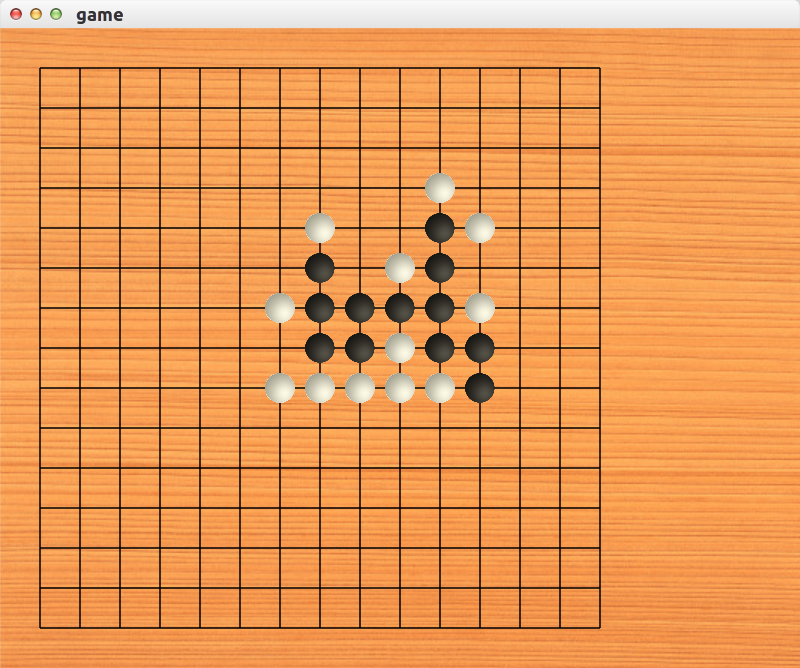

GtkFIR - 人机对战五子棋
=====================

使用博弈树算法实现的人机对战五子棋



## 项目依赖项

CMake gtkmm-3.0

ubuntu下安装方式

```
    sudo apt-get install cmake libgtkmm-3.0-dev
```

## 构建方式

在项目根目录下建立build文件夹，在该文件夹下执行cmake指令：

```
    cmake ..
    make
```

并将res文件夹复制到build目录下即可运行。
